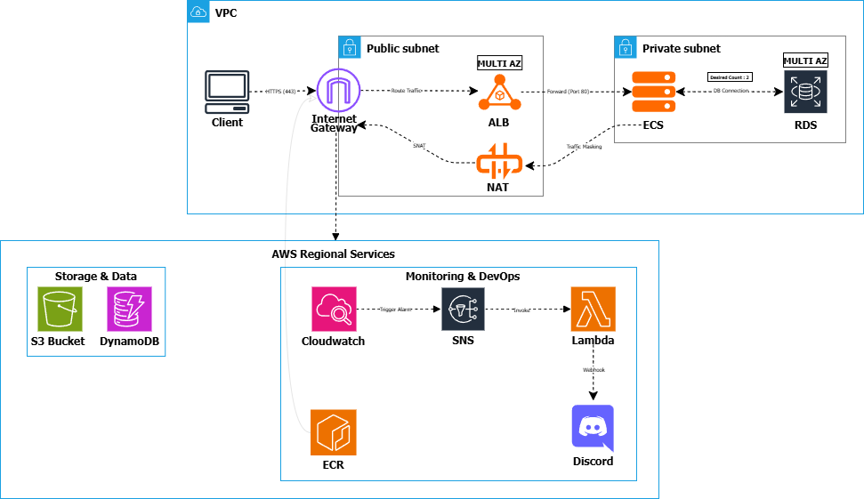

## Infrastructure Deep Dive

This architecture is designed to withstand real-world failure scenarios including container crashes, failed health checks, and Availability Zone outages—while maintaining service availability.

---

## Request Flow

Traffic flows through a multi-layered architecture designed for isolation, resilience, and controlled exposure.

1. Client → Internet Gateway → ALB

External HTTPS traffic (443) enters the VPC through an Internet Gateway and is terminated at an Application Load Balancer deployed across multiple Availability Zones.

2. ALB → ECS (Fargate)

The ALB routes traffic only to healthy targets based on health checks.
ECS services run across multiple AZs, maintaining availability even if individual tasks fail.

If a container becomes unhealthy:
Traffic is immediately drained by the ALB
ECS replaces the task to maintain desired capacity

3. ECS → RDS (Private Communication)

Application containers run in private subnets and communicate with an RDS instance configured for Multi-AZ failover.

No public database exposure
Network-level isolation reduces attack surface

4. Outbound via NAT Gateway

Private workloads access external services (e.g., APIs, image pulls) through a NAT Gateway.

No inbound access to private resources
Controlled outbound connectivity

---

## Technology Choices

The stack prioritizes managed services to reduce operational overhead while preserving production-level reliability.

Compute
ECS Fargate (serverless containers, no node management)
Load Balancing
Application Load Balancer (L7 routing + health checks)
Database
RDS (Multi-AZ failover for high availability)
Networking
VPC with public/private subnets across AZs
Internet Gateway for ingress
NAT Gateway for controlled egress
Container Registry
Amazon ECR
Observability
CloudWatch (metrics + logs)
Alerting Pipeline
CloudWatch → SNS → Lambda → Discord webhook

---

## Failure Handling

The architecture is intentionally designed around failure scenarios rather than ideal conditions.

---

## Container Crash

When a container stops:

ECS detects failure via health checks
Task is terminated and replaced automatically

Outcome:
Service remains available with minimal disruption

---

## Unhealthy Targets (ALB)

When a task fails health checks:

ALB stops routing traffic to it

Remaining healthy tasks continue serving requests
ECS replaces the failed task

Outcome:
Users never hit broken containers

---

## Availability Zone Outage

When an AZ becomes unavailable:

ALB routes traffic to remaining AZs, ECS continues running in healthy zones, RDS performs automatic failover

Outcome:
Service remains available but with reduced capacity.  
If load exceeds remaining capacity, performance degradation may occur.

---

## Database Latency

When database performance degrades:

Application latency increases
CloudWatch detects anomalies
Alerts are triggered via SNS → Discord

Outcome:
No automatic recovery at the database layer.  
System remains functional but degraded, requiring manual intervention or scaling adjustments.

---

## Observability

Visibility is centralized to reduce time-to-detection and simplify debugging.

Metrics
ECS: CPU, memory utilization

ALB: request count, latency, target health

RDS: CPU usage, connections, I/O latency

Logs

Container logs streamed to CloudWatch Logs

Centralized access for debugging and tracing
Alerts

Triggered based on defined thresholds:

High ECS CPU usage
ALB unhealthy targets
RDS latency spikes

Notifications flow through:
CloudWatch → SNS → Lambda → Discord

Outcome:
Centralized visibility enables faster detection and diagnosis of failures, reducing mean time to resolution (MTTR).

---

## Secrets Management

Sensitive data such as database credentials and API keys are stored in SSM Parameter Store.

- No hardcoded secrets in code or Terraform
- Access controlled via IAM roles
- ECS tasks retrieve secrets at runtime

---

## 🧾 IAM & Access Control

IAM roles follow the principle of least privilege:

- IAM roles follow least privilege where practical
- Some services (e.g., CloudWatch, SNS) require broader permissions due to dynamic resource creation
- Tradeoffs are documented and scoped appropriately

---

## 🔄 Deployment Strategy

ECS-native deployment using dual target groups and controlled rollout configuration.

Zero-downtime updates via over-provisioning (200% capacity)

Health check–driven replacement of tasks

Built-in rollback using deployment circuit breaker

Traffic is only routed to new tasks after passing ALB health checks, ensuring faulty deployments are never exposed to users.

---

## 🔄 CI/CD Pipeline

Automated deployment pipeline using GitHub Actions.

Builds and pushes Docker images to ECR on every commit

Triggers ECS service updates automatically

Deployment safety handled by ECS (health checks + rollback)

Each build is tagged using the commit SHA to ensure traceability.

ECS deployment circuit breaker automatically rolls back if health checks fail, preventing broken versions from reaching users.

---

### Database Layer

- RDS (Multi-AZ) for high availability
- RDS Proxy used to:
- manage connection pooling
- reduce database load under high concurrency
- improve application stability

---

## Cost Considerations
NAT Gateway used for simplicity, but incurs cost — could be optimized with NAT instances

Fargate trades cost for operational simplicity

Multi-AZ RDS increases availability at higher cost

---

## ⚠️ System Limitations

While resilient, the system still has constraints:

- NAT Gateway is a single point of cost and potential bottleneck
- RDS failover is not instantaneous and may cause brief downtime
- No autoscaling configured yet — performance depends on fixed capacity
- No caching layer — database may become a bottleneck under high load

These limitations are intentional tradeoffs for simplicity and cost control.

---